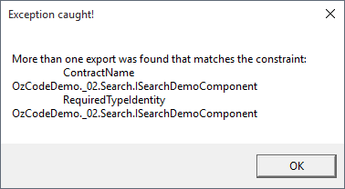
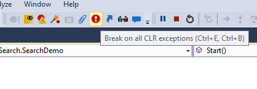
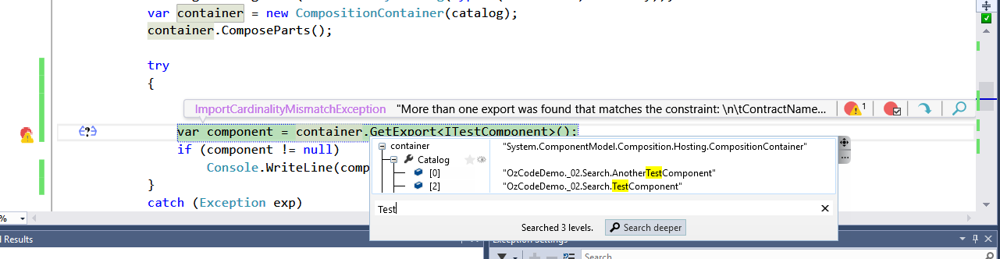
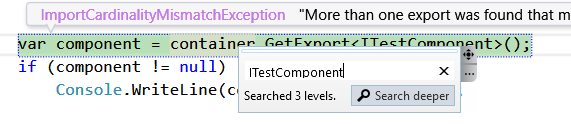
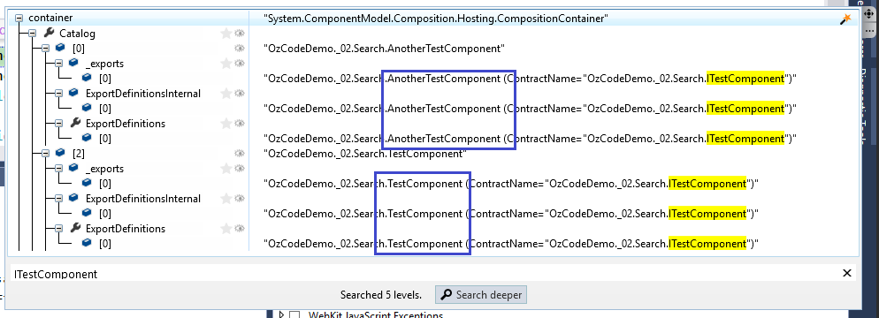

#Search
**Find that needle in a haystack of data**

##Overview
When debugging objects and collections, you are often looking for a specific property or field, or a value held within a property or field. Unfortunately, this usually involves either a lot of clicking and scrolling, or writing custom debug-specific code. Finding items (even in simple structures) is not easy, not to mention doing so in a complex object graph. With our ***Search*** feature, this is no longer the case. Quickly and effortlessly search member names and values, no matter the size of the collection or complexity of the object graph!

##Using Search

In this demo, we'll try and figure out a problem that has to do with the Managed Extensibility Framework (or MEF), which is a part of .NET that enables developers to build extensible applications with a plug-in architecture, and behaves a bit like a Dependency Injection container. If you'll notice, our entire OzCode demo application is built on top of MEF!

In order to run this demo press the _Search_ button in the demo application.  

Immediately a message box pops since an exception was thrown:
 

Oh no! This means that a MEF failure occurred, because we mistakenly registered two or more different services under the same interface. And so, when we ask MEF to give us an interface that implements the `ITestComponent` interface, MEF doesn't know which implementation to give us!

Since we want to break execution when the exception is thrown we have two options - either use Visual Studio's built-in exception settings dialog, or simply press the "Break on all CLR excetions" button:

Run the ***Search*** demo again - this time the debugger will break on the line that threw the exception.   
Hover over the _container_ variable and the DataTip window will pop-up. Click on the `Search` textbox at the bottom of the DataTip, and write "Test" to search for objects/properties with the word "Test" in them. By default, the Search will look in both the names of the fields and properties, and their respective values as well!

There are two components with very similar names inside _container_, but in order to make sure we need to dig deeper. Search again, and this time look for ITestComponent. 

At first no results show. Press "Search deeper" to reveal the components that are registered under the _ITestComponent_ contract. Each time you click "Search Deeper", OzCode will widen the search and look two levels deeper into the object graph.

[Back to Main](../../README.md)
