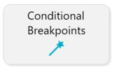
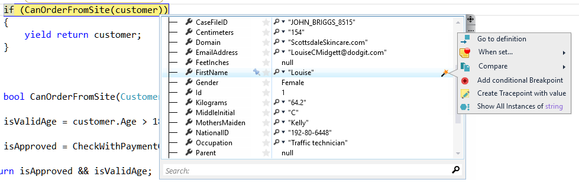
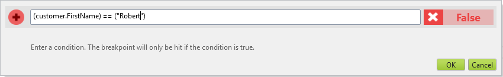
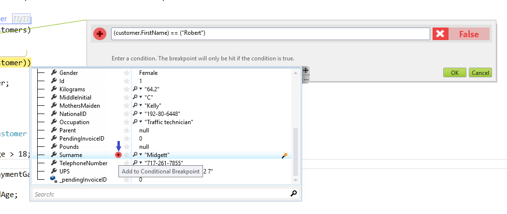
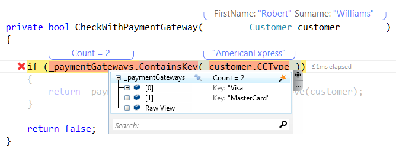
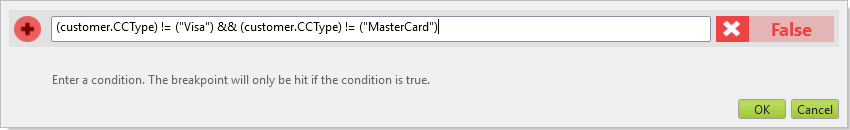

#Setting Conditional Breakpoints
**Easily and intuativly set conditional breakpoints**

##Overview
Conditional Breakpoints can make debugging so much more productive, but without OzCode, using them feels like a chore. OzCode makes adding a Conditional Breakpoint super easy! In just a single click, OzCode will set up a Conditional Breakpoint based on a specific property value, and pre-fill the predicate for you.
##Using Conditional breakpoints
In order to run this demo press the _Conditional Breakpoins_ button in the demo application.  

Everything seems ok, no exception thrown and the run finish succefully. Until we find out by our imaginary email/phone that at least one customer 'Robert Williams' was not approved and didn't get his order.
Since we have no clue why that happend we add a breakpoint at the begining of __PaymentValidation.Validate__ method.   
Running the method for all of the customers is nearly impossible. instead we want to run until we get to 'Robert Williams'.
* Pass the 'foreach' line and place the caret on the customer.   
* When the watch window appears extend customer properties and look for 'FirstName'.
* Place the caret on the first name property and 'Custom Actions' (wand) would appear
* Choose 'Add conditional breakpoint'

  
   
In the new dialog replace the current customer first name with 'Robert'

To make sure that we do not accidetly break on the wrong customer we want to add the customer surname as well ('Williams').  
There are two ways to achieve this 
- either add '&&', copy the existing text, and replace 'Robert' with 'Williams' 'FirstName' with 'SurName' (or any other property - OzCode supports code completion).
- Use OzCode's watch window: open watch and find 'SurName', andf press the little '+' sign
 
 
 
 And we're ready to go. 
 
 
 
 Press 'ok' to close the conditional breakpoint dialog and press F5 to continue running until we reach 'Robert Williams'.  
 Now if we follow the code execution  (F11) we end up in the problematic method. It seems someone has forgotten to add support to Robert's credit card (or a new card was added without support).
 
 
 
 Now we can use conditional breakpoint in order to check if there are other unsupported credit cards:
 - Place your caret on 'CCType' and select 'Add conditional breakpoint'
 - Update the condtion to so that the execution would break for any other credit card which is not 'Visa' or 'MasterCard'.
 
 
 
 Run the application again and check.
 
 [Back to Main](../../README.md)  