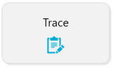
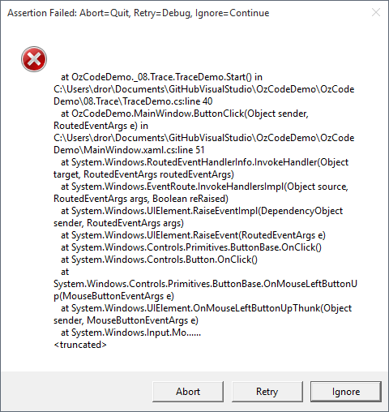
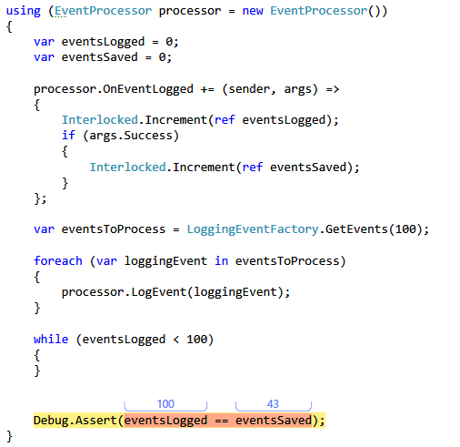
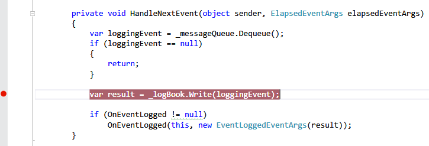
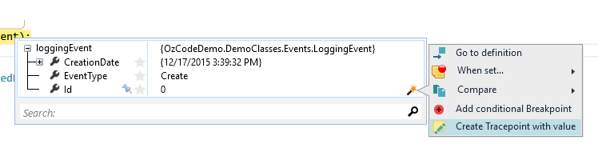
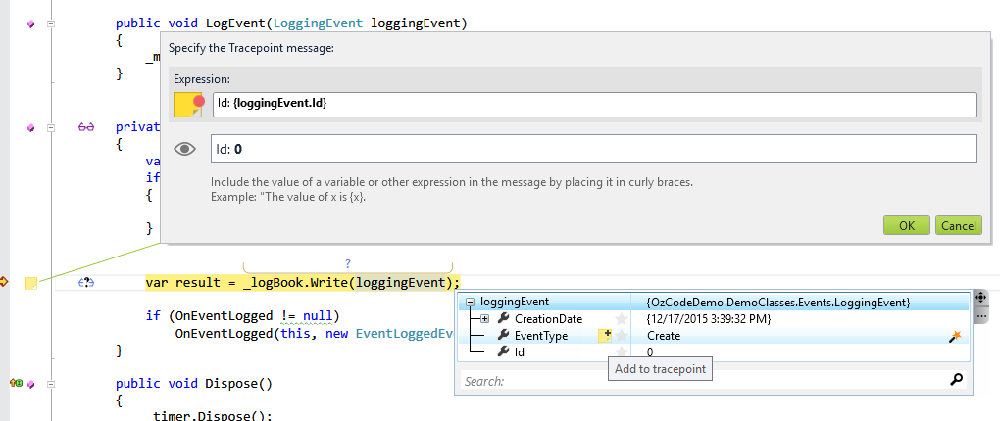
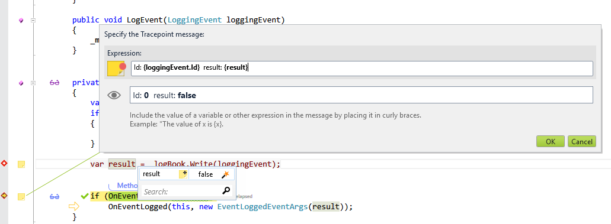
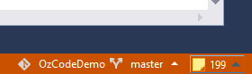
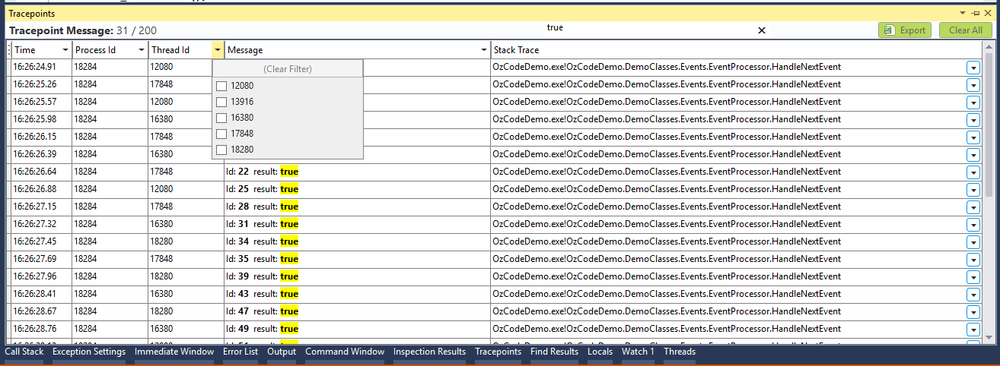

#Trace
**When things get hairy, you can easily add dynamic logging on-the-fly at key points during the program’s execution, and then view the output using the fully featured integrated log-viewer that OzCode bakes into Visual Studio**
##Overview
When you’re debugging a tough problem, especially with legacy code or a heavily multi-threaded scenario, stepping through the code to figure out what the system is doing feels like trying to juggle 12 balls in your head at once. With OzCode, when things get hairy, you can easily add dynamic logging on-the-fly at key points during the program’s execution, and then view the output using the fully featured integrated log-viewer that OzCode bakes into Visual Studio. No longer will you need to stop debugging, add logging code and then rebuild each time you want to add a simple trace!

Simply use the “Create Tracepoint” command on the value you want to trace. A Tracepoint is just like a Breakpoint, except that instead of breaking the program’s execution, it writes a _trace message_.
##Using Trace
In order to run this demo click the _Trace_ button in the demo application.  

After a short while an _Assertion Failed_ dialog will appear:

Pressing __Retry__ will cause Visual Studio to jump to the offending code. Now we can see that not all events were logged succesfully (in this case only 43 out of 100).  

__Note:__ If you're running with _Break on Exceptions_ turned on, you'll stop at the same line before the dialog appears.
 

Go to the __HandleNextEvent__ method in the __EventProcessor__ class.
Now add a break point at the line that uses _LogBook_'s _Write_ method and run again.

Once the program stops at the Breakpoint we can create the first Trace Point.  

To do so just hover over the object you want to show at the trace (in this case loggingEvent), and wait for the Watch Window to appear. 

In the Watch Window, go to the __Id__ property and click the magic wand.  

From the custom action dialog that opens, choose __Create Tracepoint with value__

 

A new dialog will appear with the value you've chosen already filled in (Id). From here you can customize the trace message and add more values using the instance name (with full intellisense support), or use the Watch Window instead.  

A new icon now appears when using a Watch Window while the Tracepoint dialog. Pressing that icon would add that value to the current Tracepoint.

 

Once you've added all of the values that interest you, and customized the perfect log message, click _Ok_ to close the dialog.  

Run to the next line, and either put a breakpoint there or move your cursor to the next line and choose __Run to cursor__ (Ctrl+F10).  

In that line, create another trace point with the event's _Id_ and the _result_ value.

Once you're finished - press _Ok_ and continue running the application.  

Notice that a new icon appears at the bottom right corner of Visual Studio with the number of logged Tracepoints.

Pressing the counter will open the tracepoint window we've added, and it can help us understand what went wrong.  

We can see each trace message along with Thread & Process, as well as a full stack trace.
All of the columns can be filtered by values and there's a search box to search for messages containing specific text. If that's not enough, you can always export the traces to Excel to continue investigating...

 

Investigating the trace messages shows that the program is trying to write many messages at the same time. In the example below, while message __9__ was being written several messages was unsuccessfully from other threads threads. All of the messages that trigger the trace while  __9__ was written were not written (for example: 8, 11, 10). A similar behavior is observed throughout the application run.

 

Since we never intended for the messages to be logged from different threads, we need to figure out why that is happening, and by looking at the beginning of the class we can find a _Timer_ that caused the incosistant behavior.

 [Back to Main](../../README.md) 
