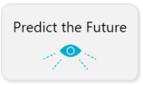
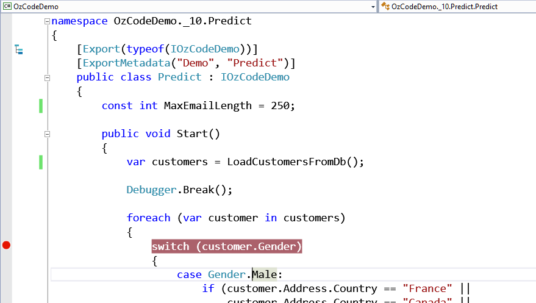
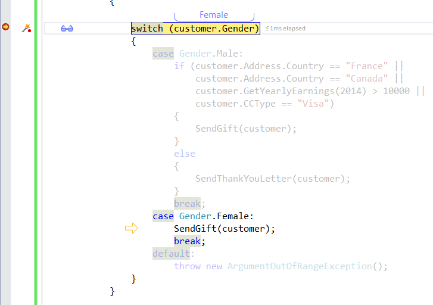
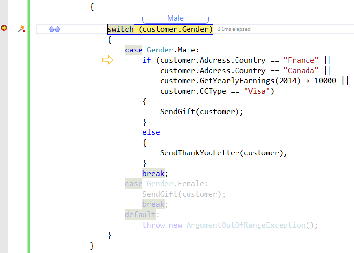
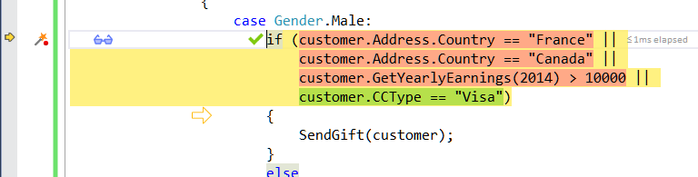
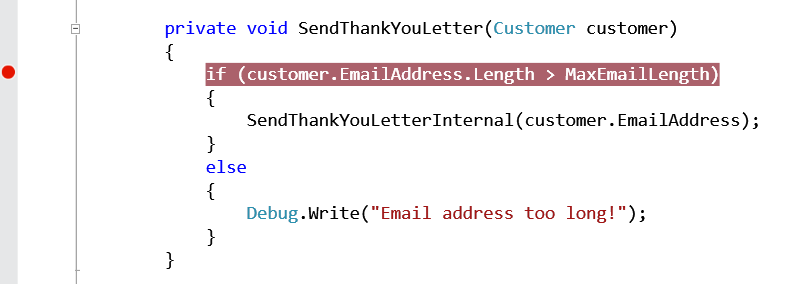
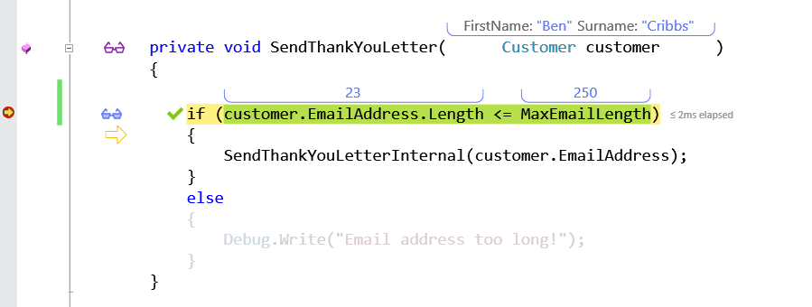
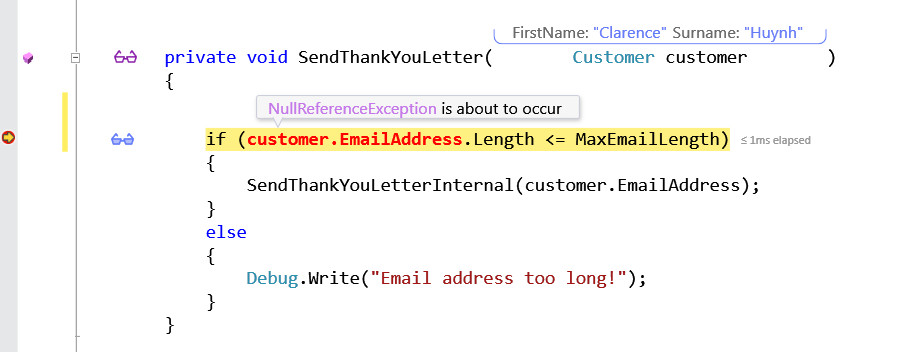

#Predict the Future
**OzCode performs predictive analysis of code execution (or as we like to call it: Fortune telling!)**

##Overview

OzCode is predicting the future: you can see the arrow pointing to where we’re going to go when we hit F10, and irrelevant code paths are made semi-transparent. Predict brings a new meaning to the term “Living Coding” by giving you instant feedback on changes you make as you’re debugging, allowing you to fix silly little coding mistakes extremely quickly.
##Using Predict
In order to run this demo press the _Predict_ button in the demo application.  

You should stop at the beginning of the method.  
Place a breakpoint at the line of the __switch statment__ and continue debug run (F5).

Once you reach the breakpoint you may notice a few things:
Only the case that would be taken is __not grayed out__ (_Gender.Female_) and there's an arrow pointing at the begning of that case.

Continue running - the next time the debugger stops at the breakpoint the gray out sections would change to show the next executed instruction - _case Gender.Male_ this time.

Press F10 to move to the next instruction and the _if_ clause should light up.
The red represent conditions that failed while the passed (_true_) condtions are marked in green. All of this is analyzed before the code run.

Since the total result of the four conditions is true a green 'V' appears near the _if_ and a yellow arrow appears near the begining of the clause body.  
Now add a breakpoint at the begining of __SendThankYouLetter(Customer customer)__

And Run until you stop at the begining of the method - can you spot the bug?
If you're using VS2015 you'll be able to use _Edit & Continue_ and replace the '>' with '<='. 

Press __F5__ to Continue debugging. The next time you reach the method another problem arose.
OzCode knows that the next instruction executed would cause a _NullReferenceException_. The origin of that exception is marked in Red (_EmailAddress_).

Now that we know what the bug is it's easy to fix by making sure that the _if_ clause to handle null email address.

 [Back to Main](../../README.md) 