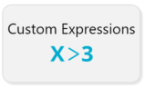
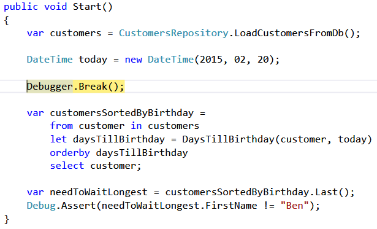
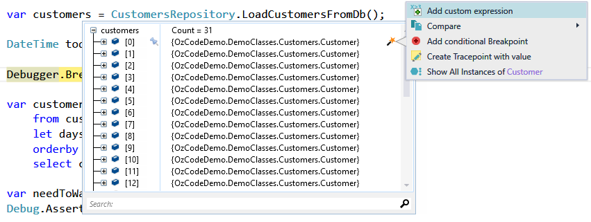
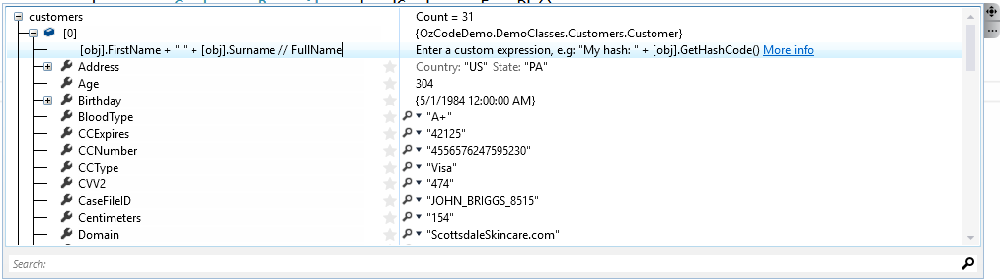
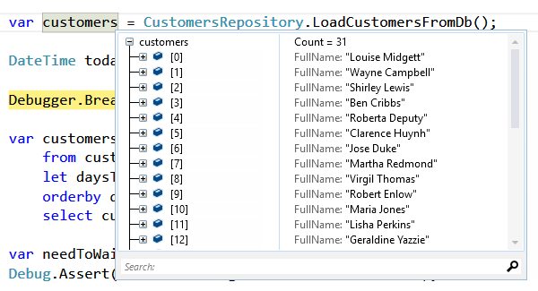
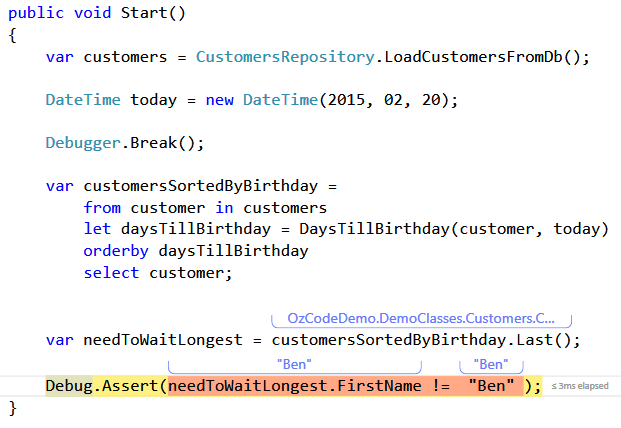
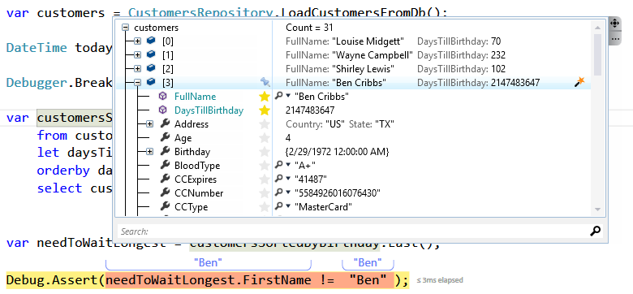

# Custom Expressions

**With our Custom Expression feature, you can create multiple custom expressions on any object type, which will be displayed just like any other member of that type. You can even star the ones that interest you the most.**

## Overview

When debugging, sometimes the information you need is not contained in the fields and properties of an object; rather, it’s a calculation or an expression that is based on your object. You might find yourself wishing you had a different set of properties just for this specific debugging session.

For example, if a Customer class has a salary history among its properties, but what you really need to see in order to fix a bug is the customer’s due taxes for a certain year, simply use the “Add Custom Expression” option on the Customer variable, and write the expression that you’d like to see. The expression will be displayed as a property of the Customer class, containing the value of the expression.

## Using Custom Expressions

In order to run this demo click the _Custom Expressions_ button in the demo application. 

You should stop just before the LINQ clause:

Before we tackle the bug in this code let's make it easier to find our way around the customer's data: 

Since a customer's name is combined from two properties: *FirstName* and *LastName* - it requires some work to find a specific customer instead let's make it easier to read customer names by adding a new "property" to the customer class.

Hover over the customers collection until the watch window appears then point the cursor at on of the customers, press the magic wand and choose "create custom expression" from the dialog.

Adding a new custom expression is done using [obj] which represents the instance* (in this case a customer) and so the new value would be *[obj].FirstName + " " + [obj].Surname*.

We can give the new property a name by using **//** - just like a comment and so by writing **[obj].FirstName + " " + [obj].Surname // FullName** we've created a new "property" on each customer instance.

Now that we have a new property we can use [Reveal](../01.Reveal/README.md) as if it's one of the original class's properties.

Now let's continue execution by pressing F10 three times. The LINQ clause should have returned the customers by the days remaining until their birthday. 

But there's a problem: the last customer should have been the first one ("Ben") but unfortunately in order to understand what just happened.

Since the method *DaysTillBirthday* is valid at this scope we can use it in a custom expression. 

- Click on a Customer in the *watch windows*
- Use the magic wand again and choose "Create custom expression". 
- In the dialog that opens write: **DaysTillBirthday([obj], today) //DaysTillBirthday**
- Press the "star" next to the new property so we can see the values for all the customers.

Notice how many days till *"Ben Cribbs"*'s birthday: 

What could have caused this issue? Perhaps his Birth date has something to do with it (hint: leap year).

[Back to Main](../../README.md) 