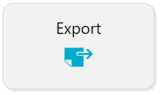
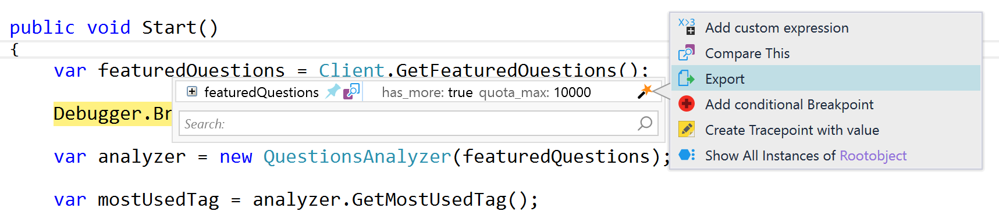
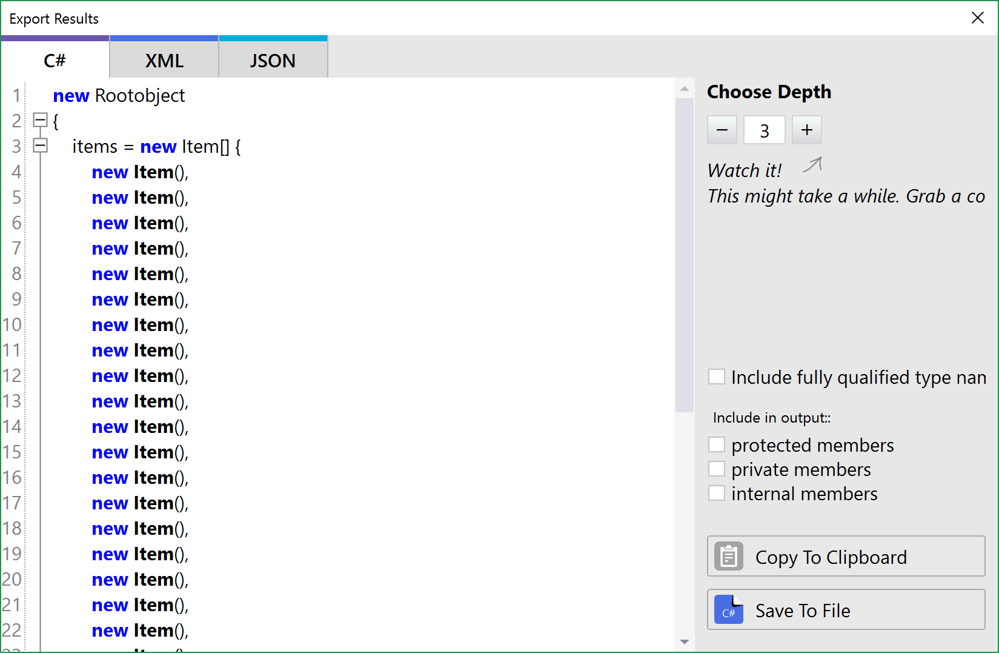
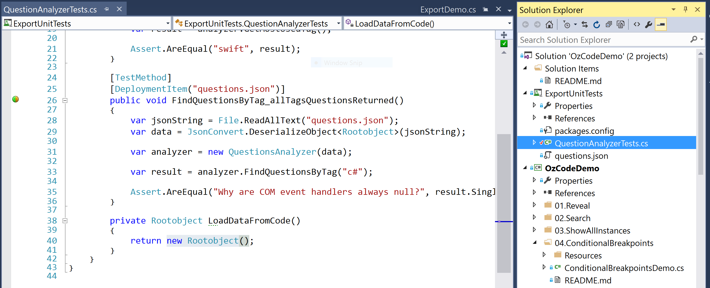

# Export

[![Download OzCode Beta][2]](http://o.oz-code.com/LINQ_EAP)   
> *This feature is currently in preview*  

**Export an instance of an object as C#, XML or json.**

## Overview

In this demo we will use *Export* during debugging to serialize an instance and use it in related unit tests.

## Using Export

In order to run this demo press the _Export_ button in the demo application.  
  

The cursor would stop on a breakpoint in the line after the data has returned from a client.
Hover over *featuredQuestions* until the quick watch window appears. Then select the magic wand and choose **Export** from the context menu.

 

A dialog would appear titled: "Export Results".

 

Notice how we only got the top most item (*new Item()*) Use "Choose Depth" to increase the depth of the exported class hierarchy. Make sure it is at least **5**.

Once you have all the items showing use *Copy To Clipboard*, close the dialog and stop debugging.
Find *ExportUnitTests* project and open **QuestionAnalyzerTests.cs** then paste the code inside *LoadDataFromCode* instead of *new Rootobject()*

Run the unit tests in that file (Ctrl+R, A). One of the tests should pass now.

To Fix the second test you'll need to export a the same class in a json format and copy the results to *questions.json* which is in the same project as the test.   

[Back to Main](../../README.md)

[2]: Resources/beta-05.png