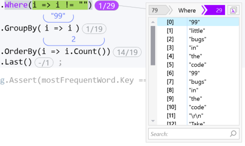
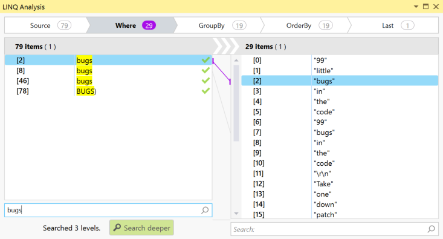

# LINQ Debugging

[![Download OzCode Beta][2]](http://o.oz-code.com/LINQ_EAP)
> *This feature is currently in preview*  
> Only Visual Studio 2015 supported

**When using LINQ a developer is forced to use tricks to find out what was the value of a specific step in one or more iterations. In some cases even completely re-writing the same code as imperative loops just to be able to check what went wrong.  
OzCode adds the tools that help understand what the query does - at a glance and if needed dive deep into the data passed between the various LINQ operators.**

## Overview   
In this demo a sentence is split into words and grouped so that we can return the word that appears the most.  
The issue is that instead of "bugs" the word "code" is returned. 
Using OzCode we can investigate this issue and fix the bug but using the new LINQ debugging capabilities.

## Using LINQ Debugging 

In order to run this demo click the _LINQ_ button in the demo application. 

You will hit a break point at the beginning of the method. 
In this demo we have a query that groups the words in a sentance and return the most frequently used word.
A quick count will show us that in this case that word is **"bugs"** (4 times).   
   
   
Run till the end of the method and you'll see a problem: the query actually returned **"code"** as the most frequent word.   

   

In order to understand what happened we need to go back to the query. Either drag the cursor back to line 19 or run the demo again and run till you get to that line.   
You should see the new numeric indicators:

These indicators show you the number of items returned by each operator. For example *Split* breaks the text into 79 strings and *Where* only let 29 of them pass to the next step.   

Clicking on one of the numbers will open the LINQ DataTip, which will show you all the items that the LINQ operator produced, or all the items the operator consumed.
Clicking on an item will update the heads up display to show that items as he moves through the various queries.
Below you can see what happened to "99" which appears twice in the original text. 

Pressing the numeric indicator of the *Where* clause will show us a list of the words that when through and we can scroll down to find the offending item, either by dragging the scroll bar or better yet use the mouse scroll wheel.  
Can you see the bug now? If not don't worry we'll drill down into the code.
Pressing the "lambda" icon in the quick tooltip or left of the query.

Pressing one of the lambda's will open the detailed query tool window where you can investigate the query - step by step.

In this window you can use [Reveal](../01.Reveal/README.md) and [Search](../02.Search/README.md) to help investigate the problem. 
Try searching for "bugs" - do you see the problem now?

Click on "BUGS)" and click on "GroupBy" from the "bread crumbs" above to see the problem. THis way you can move between the query's stages and find out exactly what happened.   
Try tracking a few items inside the query and see for yourself.

Now that you know what the problem is - fix it and verify that the query finally does what it's suppose to do:

[Back to Main](../../README.md) 

[2]: Resources/beta-05.png
